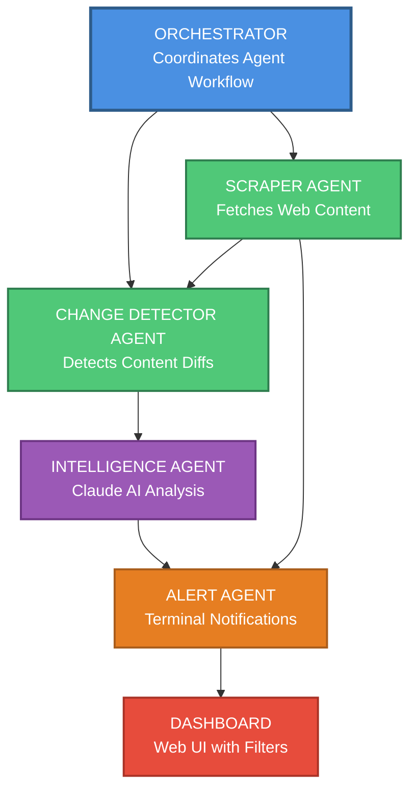

# Payment Compliance Monitor

Automated system for monitoring Visa, Mastercard, PSP, and regulatory changes affecting payment businesses.

## Problem

Payments teams (Product, Commercial, Operations, Compliance) learn about compliance deadlines 2-3 months before they hit, creating expensive fire drills. Example: Visa AFT requirements for March 2026 that most companies learned about only in December 2025.

## Solution

This system gives you 6-12 months advance warning by:
- Automatically scraping payment documentation sites
- Detecting changes using content hashing
- Analyzing changes with Claude AI to extract requirements
- Alerting on deadlines, MCCs, regions, and technical requirements

## Features

- **Hybrid Data Model**: Combines automated scraping with hard-locked manual overrides
- **Multi-Agent Architecture**: Scraper, Change Detector, Intelligence, Alert, and Orchestrator agents
- **SQLite Database**: Local persistence with deduplication and conflict resolution
- **Claude AI Integration**: Intelligent analysis of compliance changes (Opus 4.5 support)
- **Relevance Scoring**: Filters based on your MCCs, regions, and keywords
- **MVP MCC Focus**: Pre-configured for Gambling (7995), Crypto (6051), Securities (6211)
- **Interactive Dashboard**: Professional web UI with filters, search, urgency indicators, and source links
- **Manual Data Management**: Add/edit compliance items via JSON with complete control
- **Terminal Alerts**: Color-coded, detailed compliance notifications
- **Demo Mode**: Test without API calls using realistic data
- **GitHub Actions**: Automated weekly scans
- **Easy Deployment**: One-click deploy to Vercel or GitHub Pages

## Live Demo

🌐 **Dashboard:** [https://compliance-monitor.vercel.app](https://compliance-monitor.vercel.app)

## Deploy Your Own

[](https://vercel.com/new/clone?repository-url=https://github.com/ganeshgunti/compliance-monitor)

### Quick Deploy to Vercel

1. Click the "Deploy with Vercel" button above
2. Connect your GitHub account
3. Add `ANTHROPIC_API_KEY` environment variable
4. Deploy!

Your dashboard will be live at `https://your-project.vercel.app`

### Deploy to GitHub Pages

1. Fork this repository
2. Go to Settings → Pages
3. Source: Deploy from branch `main`, folder `/dashboard`
4. Add `ANTHROPIC_API_KEY` to repository secrets (Settings → Secrets)
5. Dashboard live at `https://your-username.github.io/compliance-monitor/`

## Quick Start

### 1. Installation

```bash
cd compliance-monitor
pip install -r requirements.txt
```

### 2. Configuration

```bash
# Copy environment template
cp .env.example .env

# Add your Anthropic API key to .env
# Get key from: https://console.anthropic.com/
```

### 3. Initialize

```bash
python run.py init
```

This creates the database and loads sources from `config/sources.yaml`.

### 4. Test with Demo Data

```bash
python run.py demo
python run.py list
```

This generates 5 realistic compliance items to test the system.

### 5. Run Real Scan

```bash
python run.py scan
```

This will:
1. Scrape all active sources
2. Detect changes from previous scans
3. Analyze changes with Claude AI
4. Display compliance alerts

## Project Structure

```
compliance-monitor/
├── agents/
│   ├── scraper_agent.py          # Web scraping
│   ├── change_detector_agent.py  # Diff detection
│   ├── intelligence_agent.py     # Claude AI analysis
│   ├── alert_agent.py            # Terminal output
│   └── orchestrator.py           # Agent coordination
├── config/
│   ├── sources.json              # Automated scraping sources
│   ├── company_profile.yaml      # Your MCCs, regions, keywords
│   └── settings.yaml             # System configuration
├── dashboard/
│   ├── index.html                # Dashboard UI
│   ├── app.js                    # Dashboard logic
│   ├── styles.css                # Dashboard styles
│   ├── data.json                 # Dashboard data (generated)
│   └── data.js                   # Dashboard data (for local viewing)
├── utils/
│   ├── db_utils.py               # Database functions
│   ├── demo_data.py              # Demo data generator
│   └── migrate_db.py             # Database migrations
├── data/
│   ├── compliance.db             # SQLite database
│   └── manual_overrides.json     # Hard-locked manual compliance items
├── logs/
│   └── monitor.log               # Application logs
├── docs/
│   ├── MANUAL_DATA_GUIDE.md      # Guide for adding manual data
│   ├── PRIORITY_GUIDE.md         # Priority classification guide
│   └── HYBRID_MODEL_V2.md        # Hybrid model documentation
├── requirements.txt
├── .env.example
├── run.py                        # CLI interface
└── README.md
```

## CLI Commands

```bash
# Initialize database and load sources
python run.py init

# Generate demo data for testing
python run.py demo

# Run full monitoring scan
python run.py scan

# Generate interactive dashboard
python run.py dashboard

# List all compliance items
python run.py list

# Filter by impact level
python run.py list --impact high

# Filter by relevance score
python run.py list --min-relevance 8

# Show statistics
python run.py stats

# Export data to JSON
python run.py export
```

## Configuration

### Add Monitoring Sources

Edit `config/sources.yaml`:

```yaml
sources:
  - name: "Your PSP Documentation"
    url: "https://docs.yourpsp.com/compliance"
    type: "psp_docs"
    active: true
```

### Customize Company Profile

Edit `config/company_profile.yaml`:

```yaml
company:
  name: "Your Company"
  mccs:
    - 6051  # Your MCC codes
  regions:
    - "MENA"
    - "Europe"
  keywords:
    - "AFT"
    - "crypto"
    - "your", "keywords"
```

### Adjust Settings

Edit `config/settings.yaml`:

```yaml
intelligence:
  claude_model: "claude-sonnet-4-20250514"
  max_tokens: 4000

alerts:
  min_relevance_score: 5  # Only show items >= 5
```

### Add Manual Compliance Items

Add hard-locked manual items that won't be overwritten by scrapers.

Edit `data/manual_overrides.json`:

```json
{
  "manual_compliance_items": [
    {
      "id": "unique-identifier-2026-01",
      "title": "Your Compliance Requirement Title",
      "deadline": "2026-06-30",
      "mccs": ["7995", "6051", "6211"],
      "regions": ["UAE", "Global"],
      "transaction_types": ["AFT", "OCT"],
      "impact_level": "high",
      "hard_lock": true,
      "source_name": "Card Scheme or Regulator Name",
      "source_url": "https://docs.example.com/compliance",
      "summary": "Brief summary of the requirement...",
      "technical_requirements": [
        "Technical requirement 1",
        "Technical requirement 2"
      ],
      "keywords": ["keyword1", "keyword2"],
      "relevance_score": 9,
      "notes": "Internal notes about this requirement",
      "type": "scheme_mandate"
    }
  ]
}
```

**Priority Levels:**
- `high`: Mandatory requirements with severe consequences (fines >$1M, license loss, transaction blocking)
- `medium`: Important but flexible (moderate penalties, reporting requirements)
- `low`: Pilot programs, voluntary initiatives

See `docs/MANUAL_DATA_GUIDE.md` for complete instructions and `docs/PRIORITY_GUIDE.md` for priority classification guidance.

## Architecture

### System Flow Diagram



**Flow:**
1. **Orchestrator** coordinates the entire workflow
2. **Scraper Agent** fetches content from configured sources
3. **Change Detector Agent** compares new snapshots with previous versions
4. **Intelligence Agent** analyzes changes using Claude AI to extract compliance requirements
5. **Alert Agent** displays findings in terminal and passes to dashboard
6. **Dashboard** provides interactive web UI for filtering and searching compliance items

### Multi-Agent System

1. **Scraper Agent**
   - Fetches web content using requests/BeautifulSoup
   - Extracts main text content
   - Calculates SHA256 hash
   - Saves snapshots to database

2. **Change Detector Agent**
   - Compares snapshot hashes
   - Generates unified diffs
   - Filters noise (dates, copyright notices)
   - Creates change records

3. **Intelligence Agent**
   - Sends diffs to Claude API
   - Extracts structured data (title, deadline, MCCs, requirements)
   - Calculates relevance scores
   - Creates compliance items

4. **Alert Agent**
   - Queries compliance items
   - Formats with colors and icons
   - Displays in terminal
   - Shows deadlines, requirements, impact

5. **Orchestrator**
   - Coordinates all agents
   - Handles rate limiting
   - Manages errors
   - Logs everything

### Hybrid Data Model

The system uses a **3-layer hybrid architecture** combining manual and automated data:

**Layer 1: Hard-Locked Manual Overrides**
- Stored in `data/manual_overrides.json`
- Cannot be overwritten by automated scrapers
- Highest priority in conflict resolution
- Manually curated compliance items with verified deadlines and source URLs

**Layer 2: Automated Scraped Items**
- Generated by scraping configured sources
- Analyzed by Claude AI Intelligence Agent
- Automatically extracted deadlines, MCCs, regions, and requirements
- Stored in SQLite database

**Layer 3: Conflict Resolution & Deduplication**
- Uses MD5 hash based on (title + deadline + region)
- Automated items that conflict with manual items are skipped
- Prevents duplicate entries in dashboard
- Ensures data quality and consistency

**Benefits:**
- ✅ Full control over critical compliance items
- ✅ Automated discovery of new requirements
- ✅ No duplicate entries
- ✅ Manual items always take precedence
- ✅ Easy to add/edit compliance data via JSON

See `docs/HYBRID_MODEL_V2.md` for complete implementation details.

### Database Schema

**sources**: URLs being monitored
- id, name, url, region, tier, parser_strategy, active, created_at, updated_at

**snapshots**: Content snapshots with hashes
- id, source_id, content, content_hash, scraped_at, status, error_message

**changes**: Detected differences
- id, source_id, old_snapshot_id, new_snapshot_id, diff_text, detected_at, analyzed

**compliance_items**: Parsed requirements
- id, change_id, source_id, title, summary, deadline, is_estimated, impact_level, mccs, regions, transaction_types, technical_requirements, keywords, relevance_score, hard_lock, manual_id, type, created_at

**New fields for Hybrid Model:**
- `hard_lock`: Boolean flag indicating manual override (cannot be modified by scrapers)
- `manual_id`: Reference ID from manual_overrides.json
- `is_estimated`: Boolean indicating if deadline is estimated vs. confirmed
- `type`: Compliance type (scheme_mandate, regulatory, tax_reporting, etc.)

## Relevance Scoring

Items are scored 1-10 based on:

- **Base**: 5 points
- **MCC Match**: +3 points
- **Region Match**: +2 points (or "Global")
- **Keyword Match**: +1 point (if 3+ keywords match)
- **High Impact**: +1 point
- **Maximum**: 10 points

## Cost

- **Per Scan**: ~$0.50 - $2.00 (depends on number of changes)
- **Monthly**: ~$30 - $60 (daily scans)
- **API**: Claude Sonnet 4 via Anthropic

## Roadmap

### Phase 1 - MVP ✅ Complete
- ✅ Multi-agent architecture
- ✅ SQLite database with deduplication
- ✅ Claude AI integration (Opus 4.5 support)
- ✅ Terminal alerts
- ✅ Demo data
- ✅ Hybrid data model (manual + automated)
- ✅ Interactive dashboard with filters
- ✅ MVP MCC focus (Gambling, Crypto, Securities)
- ✅ Manual data management via JSON
- ✅ Priority classification (HIGH/MEDIUM/LOW)
- ✅ JSON export
- ✅ Vercel deployment support

### Phase 2 - In Progress
- ⏳ GitHub Actions scheduled scans
- ⏳ Email alerts via SendGrid
- ⏳ Slack webhook notifications
- ⏳ Timeline view in dashboard
- ⏳ Expanded MCC coverage beyond MVP
- ⏳ PDF report generation

### Phase 3 - Future
- 📋 Multi-user support with authentication
- 📋 Web configuration UI (no YAML editing)
- 📋 Postgres database migration
- 📋 Fully hosted SaaS deployment
- 📋 RESTful API access
- 📋 Mobile app (iOS/Android)
- 📋 Webhook integrations (Zapier, Make.com)

## Example Output

```
================================================================================
COMPLIANCE ALERT SUMMARY
================================================================================
Total Items: 5 | Displaying: 5
🔴 High: 3 | 🟡 Medium: 2 | 🟢 Low: 0
================================================================================

================================================================================
🔴 HIGH PRIORITY: Visa AFT Recipient Data Requirements
Deadline: 2026-03-31 (85 days)
MCCs: 6051, 6211 | Regions: Global
Transaction Types: AFT, Original Credit

Summary:
  Visa is mandating new recipientDetails fields for all Account Funding
  Transactions (AFT). Merchants must include enhanced recipient information.

Technical Requirements:
  • Add recipientDetails object to AFT API requests
  • Include recipientName, recipientAddress, recipientAccountNumber fields
  • Implement validation for required fields before submission
  • Update error handling for new decline codes
  • Add logging for recipient data validation failures

Relevance Score: 10/10
Source: Nuvei - Card Scheme Programs
https://docs.nuvei.com/documentation/security-docs/risk-guide/schemes-programs/
================================================================================
```

## Troubleshooting

### "ANTHROPIC_API_KEY not found"
- Copy `.env.example` to `.env`
- Add your API key from https://console.anthropic.com/

### "Database not found"
- Run `python run.py init` first

### "No active sources found"
- Check `config/sources.yaml` has sources with `active: true`

### Rate limiting / timeouts
- Adjust `rate_limit_seconds` in `config/settings.yaml`
- Increase `timeout_seconds` for slow sites

## Contributing

Contributions welcome! Areas for improvement:
- Additional sources (Visa, Mastercard, regional regulators)
- Better change detection (ML-based filtering)
- Dashboard implementation
- Email/Slack alerting
- Deployment guides

## License

MIT License - Feel free to use for commercial purposes.

## Author

Built by Ganesh Iyer
- Targeting highly regulated industries (e.g. Gambling, Crypto, Brokerage/Securities)
- Solving real payment compliance monitoring problems
- Demonstrating multi-agent AI systems

## Contact

Questions? Feedback? Want to hire me?
- LinkedIn: https://www.linkedin.com/in/ganesh-iyer-38317616/
- Email: ganesh.iyer316@gmail.com

---

**Value Proposition**: This system saves $500K+ per compliance deadline by giving you 12+ months advance warning instead of 3-month fire drills.
