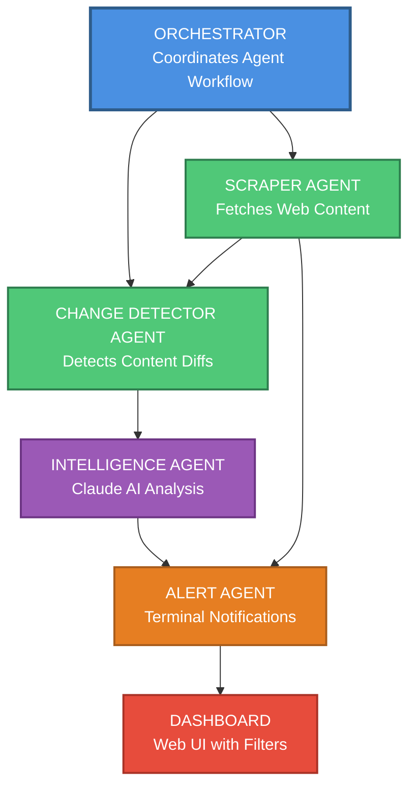

# Payment Compliance Monitor

Open-source tool for monitoring Visa, Mastercard, PSP, and regulatory changes affecting payment businesses.

Built with Claude Code in 48 hours using a multi-agent system. **This is v1**—feedback welcome.

---

## The Problem

Payments teams learn about compliance deadlines 2-3 months before they hit. By then, it's a fire drill.

**Example:** Visa AFT requirements (March 2026)
- Most companies found out: Q4 2025 → 3 months to implement
- Actually published: June 2024 → 21 months available

That's the difference between a planned rollout and a £500K emergency sprint.

Updates are scattered across PSP docs, regulator sites, card schemes. Released asynchronously. Written in legal language. Rarely flagged early.

---

## The Solution

Multi-agent system that continuously monitors changes so teams can see them earlier and plan properly.

**How it works (hybrid approach):**

→ **Automated monitoring** of Visa, Mastercard, regulators, PSPs
→ **Manually curated data** for credibility and relevance
→ **AI-powered analysis** extracts deadlines, MCCs, technical requirements
→ **Dashboard** with filtering by MCC, region, priority

**The architecture:**

- **Scraper Agent** → Monitors 15+ compliance sources
- **Change Detector** → Filters signal from noise
- **Intelligence Agent** → Extracts structured data (Claude AI)
- **Alert Agent** → Updates dashboard

An **orchestrator** coordinates the sub-agents autonomously.

---

## Live Demo

🌐 **Dashboard:** https://compliance-monitor.vercel.app

**Current coverage:** 18 compliance changes for 2026
- Visa AFT recipient data
- UK Gambling Commission updates
- UAE CBUAE crypto licensing
- US GENIUS Act (stablecoins)
- VAMP dispute thresholds

**Built for:** Highly regulated payment industries and merchant category codes (MCCs)
- Crypto (6051)
- Trading/Forex (6211)
- Gambling (7995)
- BNPL
- Payment processors

---

## Quick Start

### 1. Installation
```bash
git clone https://github.com/yourusername/compliance-monitor.git
cd compliance-monitor
pip install -r requirements.txt
```

### 2. Configuration
```bash
# Copy environment template
cp .env.example .env

# Add your Anthropic API key to .env
# Get key from: https://console.anthropic.com/
```

### 3. Initialize
```bash
python run.py init
```

Creates database and loads sources from `config/sources.yaml`.

### 4. Test with Demo Data
```bash
python run.py demo
python run.py list
```

Generates 5 realistic compliance items to test the system.

### 5. Run Real Scan
```bash
python run.py scan
```

This will:
- Scrape all active sources
- Detect changes from previous scans
- Analyze changes with Claude AI
- Display compliance alerts

---

## CLI Commands
```bash
# Initialize database and load sources
python run.py init

# Generate demo data for testing
python run.py demo

# Run full monitoring scan
python run.py scan

# Generate interactive dashboard
python run.py dashboard

# List all compliance items
python run.py list

# Filter by impact level
python run.py list --impact high

# Show statistics
python run.py stats

# Export data to JSON
python run.py export
```

---

## Deploy Your Own

### Deploy to Vercel (Recommended)

[](https://vercel.com/new/clone?repository-url=https://github.com/yourusername/compliance-monitor)

1. Click "Deploy with Vercel" button
2. Connect your GitHub account
3. Add `ANTHROPIC_API_KEY` environment variable
4. Deploy!

Your dashboard will be live at `https://your-project.vercel.app`

### Deploy to GitHub Pages

1. Fork this repository
2. Go to **Settings → Pages**
3. Source: Deploy from branch `main`, folder `/dashboard`
4. Add `ANTHROPIC_API_KEY` to repository secrets
5. Dashboard live at `https://your-username.github.io/compliance-monitor/`

---

## Configuration

### Add Monitoring Sources

Edit `config/sources.yaml`:
```yaml
sources:
  - name: "Your PSP Documentation"
    url: "https://docs.yourpsp.com/compliance"
    type: "psp_docs"
    active: true
```

### Customize Your Profile

Edit `config/company_profile.yaml`:
```yaml
company:
  name: "Your Company"
  mccs:
    - 6051  # Your MCC codes
  regions:
    - "MENA"
    - "Europe"
  keywords:
    - "AFT"
    - "crypto"
```

### Add Manual Compliance Items

Add hard-locked manual items in `data/manual_overrides.json`:
```json
{
  "manual_compliance_items": [
    {
      "id": "unique-id-2026-01",
      "title": "Your Compliance Requirement",
      "deadline": "2026-06-30",
      "mccs": ["7995", "6051"],
      "regions": ["UAE", "Global"],
      "impact_level": "high",
      "hard_lock": true,
      "source_url": "https://docs.example.com/compliance",
      "summary": "Brief summary...",
      "technical_requirements": [
        "Requirement 1",
        "Requirement 2"
      ]
    }
  ]
}
```

See `docs/MANUAL_DATA_GUIDE.md` for complete instructions.

---

## Architecture

### System Flow Diagram



### Multi-Agent System

**Scraper Agent**
- Fetches web content
- Calculates content hashes
- Saves snapshots

**Change Detector Agent**
- Compares snapshots
- Generates diffs
- Filters noise

**Intelligence Agent**
- Sends diffs to Claude AI
- Extracts structured data
- Calculates relevance scores

**Alert Agent**
- Formats findings
- Updates dashboard
- Color-coded output

**Orchestrator**
- Coordinates all agents
- Handles rate limiting
- Manages errors

### Hybrid Data Model

**3-layer architecture:**

1. **Hard-Locked Manual Overrides** (`data/manual_overrides.json`)
   - Cannot be overwritten by scrapers
   - Highest priority
   - Manually verified

2. **Automated Scraped Items** (SQLite database)
   - Generated by scraping
   - Analyzed by Claude AI
   - Auto-extracted requirements

3. **Conflict Resolution**
   - MD5 hash deduplication
   - Manual items take precedence
   - No duplicates in dashboard

See `docs/HYBRID_MODEL_V2.md` for details.

---

## Project Structure
```
compliance-monitor/
├── agents/
│   ├── scraper_agent.py          # Web scraping
│   ├── change_detector_agent.py  # Diff detection
│   ├── intelligence_agent.py     # Claude AI analysis
│   ├── alert_agent.py            # Terminal output
│   └── orchestrator.py           # Agent coordination
├── config/
│   ├── sources.json              # Scraping sources
│   ├── company_profile.yaml      # Your MCCs, regions
│   └── settings.yaml             # System config
├── dashboard/
│   ├── index.html                # Dashboard UI
│   ├── app.js                    # Dashboard logic
│   └── data.json                 # Generated data
├── data/
│   ├── compliance.db             # SQLite database
│   └── manual_overrides.json     # Manual items
├── docs/                          # Documentation
├── run.py                        # CLI interface
└── README.md
```

---

## Example Output
```
================================================================================
COMPLIANCE ALERT SUMMARY
================================================================================
Total Items: 5 | Displaying: 5
🔴 High: 3 | 🟡 Medium: 2 | 🟢 Low: 0
================================================================================

================================================================================
🔴 HIGH PRIORITY: Visa AFT Recipient Data Requirements
Deadline: 2026-03-31 (85 days)
MCCs: 6051, 6211 | Regions: Global
Transaction Types: AFT

Summary:
  Visa mandates new recipientDetails fields for all Account Funding
  Transactions (AFT). Enhanced recipient information required.

Technical Requirements:
  • Add recipientDetails object to AFT API requests
  • Include recipientName, recipientAddress, recipientAccountNumber
  • Implement validation for required fields
  • Update error handling for new decline codes

Relevance Score: 10/10
Source: Nuvei - Card Scheme Programs
https://docs.nuvei.com/documentation/...
================================================================================
```

---

## Cost

**Per Scan:** ~$0.50 - $2.00 (depends on changes detected)
**Monthly:** ~$30 - $60 (daily scans)
**API:** Claude Sonnet 4 via Anthropic

---

## Roadmap

### ✅ Phase 1 - Complete (v1)
- Multi-agent architecture
- SQLite database with deduplication
- Claude AI integration
- Interactive dashboard
- Hybrid data model (manual + automated)
- MVP MCC focus (Gambling, Crypto, Securities)

### ⏳ Phase 2 - In Progress
- GitHub Actions scheduled scans
- Email alerts
- Slack notifications
- Timeline view
- Expanded MCC coverage
- PDF reports

### 📋 Phase 3 - Future Ideas
- Multi-user support
- Web configuration UI
- Postgres migration
- RESTful API
- Mobile app
- Webhook integrations

---

## What I Learned Building This

**Claude Code changed everything.**

Before: "Agent orchestration" sounded complex.

With Claude Code: I described the problem and system design. Claude built the entire architecture, database schema, dashboard, and deployment setup.

From my laptop. 48 hours.

The shift—from building plumbing to solving problems—is transformative.

This is what becomes possible when you combine deep domain knowledge with AI that can design and build systems.

---

## Contributing

This is v1 with plenty of gaps and rough edges. Contributions welcome!

**Areas for improvement:**
- Additional sources (regional regulators, more PSPs)
- Better change detection (ML-based filtering)
- Enhanced dashboard features
- Email/Slack alerting
- Deployment guides

---

## Feedback

**Would love to hear:**
- Is this useful for your team?
- What's missing or wrong?
- What compliance changes have caught your team off guard?

Open an issue or PR!

---

## License

MIT License - Feel free to fork and customize for your needs.

---

## Author

Built by **Ganesh Iyer** as a side project to explore multi-agent AI systems and solve real payment compliance problems.

**Background:** Head of Payments Product at Entain (FTSE 100), 15+ years in payments across iGaming, fintech, and e-commerce.

**LinkedIn:** https://www.linkedin.com/in/ganesh-iyer-38317616/
**Email:** ganesh.iyer316@gmail.com

---

**This system gives payments teams 6-12 months advance warning instead of 2-3 month fire drills.**

Fork it. Make it better. Share your feedback.
